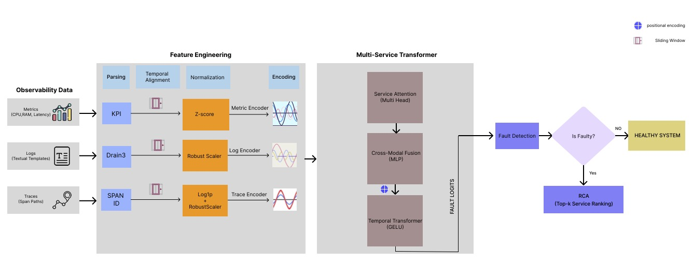

# ASTRA – Attentive Spatio-Temporal Root-cause Analyzer

This project implements a two-stage temporal multimodal model for detecting  
faults and performing root cause analysis (RCA) in a microservice-based social network application.


[](https://www.python.org/)
[](https://pytorch.org/)
[](https://pytorch.org/docs/stable/generated/torch.nn.Transformer.html)
[](https://zenodo.org/records/7615394)
[](LICENSE)

---

## Quick Start (Kaggle)

1. **Open the notebook**: In Google Colab or Locally in your computer
2. **Add datasets** (see [Dataset section](#dataset) for details):
3. **Enable GPU** in notebook settings (T4 x2 or higher)
4. **Run all cells** Some parts are not necessary to be runned

---

## Table of Contents

- [Overview](#overview)
- [Architecture](#architecture)
- [Performance](#performance)
- [Installation](#installation)
- [Dataset](#dataset)
- [Usage](#usage)
- [Project Structure](#project-structure)
- [Technical Details](#technical-details)
- [Results](#results)
- [Requirements](#requirements)
- [Citation](#citation)
- [License](#license)
- [Contributors](#contributors)

---

## Overview

The following steps were performed:

- Loads metrics, traces, and logs from the Eadro paper (Social Network dataset)
- Loads 36 fault-injection episodes across 12 services (each service has 3 fault types: CPU overload, network delay, and packet loss).
- Performs temporal alignment to synchronize metrics, traces, logs, and fault intervals on a common timeline.
- Builds sliding-window multimodal representations (metrics + traces + logs) for each service over time.
- Normalizes and encodes each modality into fixed-size feature tensors.
- Applies chunking and sliding-window sampling to generate DataLoaders while reducing class imbalance from the limited number of fault episodes.
- Builds a full multimodal temporal transformer, combining cross-modal gated fusion, service attention, positional encoding, and temporal transformer layers.
- Trains and evaluates a Stage-1 fault detection model, tuning the decision threshold on validation/test samples to identify faulty services.
- Evaluates a Stage-2 RCA model that ranks and highlights the services most affected (root causes / impacted services) during each experiment episode.
- Loads and evaluates saved PyTorch checkpoints for reproducible experiments and faster analysis.

---

## Architecture

The ASTRA framework processes heterogeneous data through a synchronized spatio-temporal pipeline to identify and localize microservice failures.

<p align="center">
<a href="ASTRA-Figures/AstraFrameWork.pdf">


</a>
<br>
<em>(Click image to view high-resolution PDF)</em>
</p>


### 1. Feature Engineering (Data Ingestion)
This stage transforms raw observability data into a unified multimodal representation:

* **Observability Data Sources**: The system ingests **Metrics** (CPU, RAM, Latency), **Logs** (Textual Templates), and **Traces** (Span Paths).
* **Parsing & Temporal Alignment**: 
    * **Metrics** are parsed into Key Performance Indicators (KPIs).
    * **Logs** are processed using the **Drain3** clustering algorithm to generate textual templates.
    * **Traces** are identified and followed via **SPAN IDs**.
    * All modalities undergo **Sliding Window** alignment to synchronize disparate data frequencies into a common timeline.
* **Normalization & Encoding**: 
    * **Metrics** are scaled using **Z-score** normalization.
    * **Logs** are normalized via a **Robust Scaler**.
    * **Traces** are processed with a **Log1p** transform followed by a Robust Scaler.
    * Each stream is passed through dedicated **Encoders** to produce fixed-size feature tensors.

### 2. Multi-Service Transformer (The Core)
The analytical engine captures complex dependencies across services and time:

* **Service Attention (Multi-Head)**: A spatial attention layer that learns the structural topology and dependencies of the 12 microservices.
* **Cross-Modal Fusion (MLP)**: An adaptive gated mechanism that fuses feature embeddings into a single representational space.
* **Temporal Transformer (GELU)**: Incorporates **Positional Encoding** and **GELU** activation functions to capture long-range failure chains.

### 3. Two-Stage Diagnostic Pipeline
The **Fault Logits** generated by the transformer drive a logical decision-making process:

| Component | Logic | Outcome |
| :--- | :--- | :--- |
| **Stage 1: Fault Detection** | Binary classification to detect anomalies in the current window. | If "No", the system is marked as **Healthy**. |
| **Stage 2: RCA** | Triggered only upon a positive fault detection. | Performs **Top-k Service Ranking** to pinpoint the root cause. |

---


## Dataset
This project uses the dataset:

> **"Traces, Metrics, and Logs for Anomaly Detection and Root Cause Localization in Microservices"**

hosted on Zenodo:

https://zenodo.org/records/7615394

From that page, download:

```
SN Dataset.zip
```

Due to size and licensing, the raw dataset is **NOT included** in this repository.  
Please always download it from the official Zenodo record above.

After downloading:

1. Extract `SN Dataset.zip`.
2. Place the extracted folder so that your structure matches what the notebook expects, for example:

```
/content/drive/MyDrive/Anomaly-RC-Dataset/
    social-network-eadro/
        data/
        nofault/
        ... (metrics, logs.json, etc.)
```

3. If you use a different path, update the paths and name of directories in `ASTRA_Final.ipynb`
   where logs, metrics, trace paths, and label files are defined.

---

## Environment and Requirements
The notebook is designed to run in Google Colab or any Jupyter environment with the
following packages installed.

### Python
- Python 3.x

### Core libraries
- torch
- numpy
- pandas
- matplotlib
- seaborn
- scikit-learn
- scipy
- tqdm
- intervaltree
- drain3
- joblib
- networkx

These cover all imports used in the core modelling and analysis code, including:
- Data handling and preprocessing (numpy, pandas, scikit-learn, scipy)
- Deep learning and DataLoaders (torch, torch.nn, torch.utils.data)
- Visualization (matplotlib, seaborn)
- RCA and metrics (scikit-learn metrics, ndcg_score)
- Log clustering and intervals (drain3, intervaltree)
- Causal/graph visualization (networkx)
- Utilities and model persistence (tqdm, joblib)

Example installation with pip:

```bash
pip install torch numpy pandas matplotlib seaborn scikit-learn scipy tqdm intervaltree drain3 joblib networkx
```

---

## Research Questions
This project is structured around the following research questions:

- **RQ1:** How effectively can a temporal multimodal transformer detect anomalies and localize  
  root causes in microservice-based systems?
- **RQ2:** How do temporal dependencies between metrics, logs and traces evolve under different  
  fault types, and how reliably do they capture fault propagation patterns?
- **RQ3:** How robust is adaptive multimodal fusion in improving precision when data sources  
  are noisy, incomplete or partially missing?
- **RQ4:** To what extent can the proposed framework perform instance-level root cause analysis  
  and diagnostic reasoning that matches real fault propagation behavior?
- **RQ5:** How useful is an explicit causal graph for analyzing multimodal root causes across  
  different microservice topologies?
- **RQ6:** Do transformer-based models capture long-range failure chains more effectively than  
  graph-based baselines?
- **RQ7:** How well does a transformer-based multimodal RCA model scale, in both performance  
  and training efficiency, as the number of services increases?

---

## Notebook Structure
High-level sections of `ASTRA_Final.ipynb`:

### 1. Setup and Data Access
- Mount Google Drive:
  ```python
  from google.colab import drive
  drive.mount('/content/drive')
  ```
- Navigate to the dataset directory:
  ```
  /content/drive/MyDrive/Anomaly-RC-Dataset/
  ```
- List available runs, metrics, traces, logs and preprocessed/model files.

### 2. Log / Metric / Trace Loading and Preprocessing
- Define and load metrics, traces and logs files (faulty and no-fault runs).
- Perform temporal alignment so that all three modalities and fault intervals share a common timeline.
- Build sliding-window sequences over time; for each modality, this demonstrates 11,247 windows per service (shape approximately `[11247, 12]`).
- Normalize each modality separately (metrics, logs, traces).
- Encode each modality with an MLP into 32-dimensional embeddings, producing:
  ```
  metrics: [12, num_windows, 32]
  traces:  [12, num_windows, 32]
  logs:    [12, num_windows, 32]
  ```
- Apply chunking of windows and a careful sliding-window sampling strategy.
  ```
  metrics: [2748, 12, 256, 32]
  traces:  [2748, 12, 256, 32]
  logs:    [2748, 12, 256, 32]
  ```

### 3. Fault and RCA Label Construction
- Construct a fault label tensor with shape `[2748, 256, 12]`, indicating for each window and service whether a fault is present (any of CPU overload, network delay, packet loss).
- Construct an RCA label tensor with shape `[2748, 256, 12, 3]`, one-hot over the three fault types per service.
- Ensure labels are aligned with the multimodal windows and fault-injection episodes.

### 4. Datasets and DataLoaders
- Split windows into train/validation/test sets in a way that avoids leakage between splits and respects the distribution of fault episodes.
- Define `FaultDataset` and related dataset classes to return:
  ```
  (Xm, Xt, Xl, Y_fault)
  ```
  and corresponding RCA labels where needed.
- Build PyTorch DataLoader for Stage-1 and Stage-2.
- Use `WeightedRandomSampler` in the training DataLoader to handle class imbalance without oversampling into validation or test.

### 5. Fault Detection
- Construct binary labels per window indicating whether any service in that window is faulty.
- Perform stratified train/validation/test splits over windows.
- Define the Stage-1 model:
  ```
  MultiServiceTransformerMidFusionMultiHead
  ```
  which includes cross-modal fusion, service attention, positional encoding and temporal transformer layers.
- Train the model for multiple epochs or load a checkpoint such as:
  ```
  best_stage1_crossmodal_6Dec.pt
  ```
- Collect logits and labels on validation/test sets.
- Tune a decision threshold in logit space to maximize F1.
- Report metrics including precision, recall, F1 and accuracy at both global and per-service levels.

### 7. Analysis, Ranking and Visualization
- Summarize service rankings and RCA scores across fault scenarios  
  to assess how well the model identifies root causes and impacted services (RQ1).
- Visualize temporal fault propagation and service activations using time-series plots to  
  study how faults evolve across services (RQ2).
- Demonstrates modality-fusion weights to find out adaptive fusion method under noisy and imbalanced modality (RQ3).
- Focusing on Interpretability and human vs RCA agreement by visualizing diagrams and attention attribution (RQ4).
- Generate additional plots such as heatmaps, attention maps, and causal/graph-based views —  
  to interpret learned dependencies, compare with graph-based baselines, and analyze scalability across different service topologies (RQ5, RQ6, RQ7).

---

## How to Run in Google Colab
1. Upload `ASTRA_Final.ipynb` to Google Colab, or open it directly from Google Drive.
2. Mount Google Drive:
   ```python
   from google.colab import drive
   drive.mount('/content/drive')
   ```
3. Download and extract the dataset:
   - From:
     https://zenodo.org/records/7615394
   - Download `SN Dataset.zip` and extract it.
   - Place the extracted `SN Dataset` folder into:
     ```
     /content/drive/MyDrive/Anomaly-RC-Dataset/
     ```
     so that the notebook paths remain valid.
4. Execute the notebook:
   - For a full pipeline, run the core sections in order:
     - Data loading and preprocessing
     - Stage-1 fault detection (training/evaluation or checkpoint loading)
   - Several cells/sections are exploratory or for additional testing only.
     You can safely skip those and focus on the main pipeline cells indicated
     in the notebook comments/markdown (sections marked as main blocks).

---

## Required Citation
When you use this dataset in your research or project, please cite the original paper
as requested by the authors:

Lee, C., Yang, T., Chen, Z., Su, Y., & Lyu, M. R. (2023).  
**"Eadro: An End-to-End Troubleshooting Framework for Microservices on Multi-source Data"**.  
In *45th IEEE/ACM International Conference on Software Engineering (ICSE 2023)*, Melbourne, Australia.

### BibTeX
```bibtex
@inproceedings{DBLP:conf/icse/LeeYCSL23,
  author    = {Cheryl Lee and Tianyi Yang and Zhuangbin Chen and Yuxin Su and Michael R. Lyu},
  title     = {Eadro: An End-to-End Troubleshooting Framework for Microservices on Multi-source Data},
  booktitle = {45th {IEEE/ACM} International Conference on Software Engineering, {ICSE} 2023, Melbourne, Australia, May 14-20, 2023},
  pages     = {1750--1762},
  publisher = {{IEEE}},
  year      = {2023},
  url       = {https://doi.org/10.1109/ICSE48619.2023.00150},
  doi       = {10.1109/ICSE48619.2023.00150}
}
```
